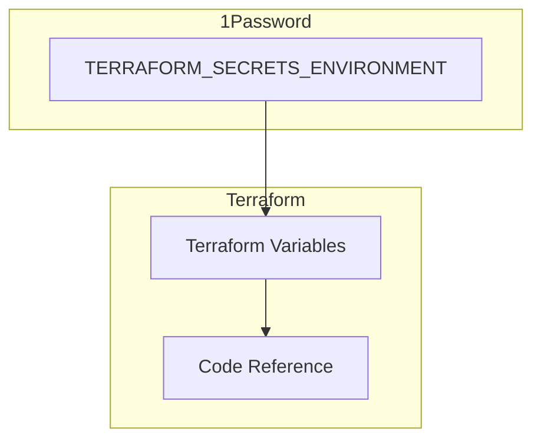
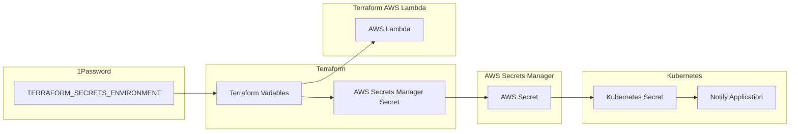
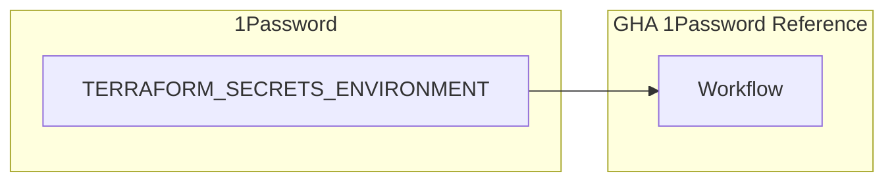
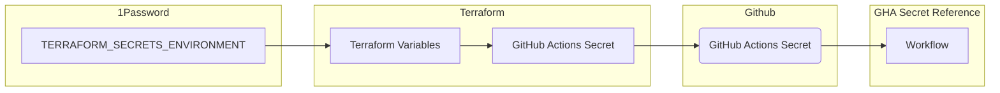

# Creating Secrets for GC Notify

## Overview

All secrets for GC Notify are stored in a single source of truth: 1Password. This way when it comes time to rotate secrets, we can ensure that we only have to change secrets in one location for it to take effect over the various components and environments of GC Notify.

There are two 1Password vaults - one for production and one for everything else. All secrets are stored in a TF Vars file stored in 1Password under the naming convention:

```
TERRAFORM_SECRETS_<ENVIRONMENT>
```

The staging secrets for example would be:

```
TERRAFORM_SECRETS_STAGING
```

## Creating Secrets

### Infrastructure Secrets

Secrets for the GC Notify infrastructure (typically used by Terraform directly) should simply be stored in the 1Password vault and referenced appropriately.



#### Step by Step Example

Suppose we need to add a new AWS account id for a new environment.

1. Add the secret as a key/value pair in the 1Password TERRAFORM_SECRETS_ENVIRONMENT entry

```
dev_account_id              = "123456789012"
staging_account_id          = "123456789013"
production_account_id       = "123456789014"
sandbox_account_id          = "123456789015"
new_environment_account_id  = "123456789017"
```

2. Declare the new account id as a sensitive variable in the env/variables.tf file in notification-terraform. __Make sure to mark it as sensitive__

```terraform
variable "new_environment_account_id" {
  type = string
  sensitive = true
}
```

3. Reference the new account id as needed in the terraform code

```terraform
resource "aws_iam_role" "new_environment_dns_manager" {
  name  = "new_environment_dns_manager_role"

  assume_role_policy = <<EOF
{
  "Version": "2012-10-17",
  "Statement": [
    {
      "Action": "sts:AssumeRole",
      "Principal": {
        "AWS": "${var.new_environment_account_id}"
      },
      "Effect": "Allow",
      "Sid": ""
    }
  ]
}
EOF
}
```

### Manifests (GC Notify App) Secrets

Secrets to be used by GC Notify applications are managed by Terraform but sent to the AWS Secrets Manager to be referenced by either Terraform for AWS Lambdas or by Kubernetes.

_Note that lambda secrets are currently reading directly from 1Password instead of the AWS Secrets Manager since we have direct access in the Terraform code. It is still recommended/required to create a corresponding AWS Secrets Manager secret since the parts of notify like the API are deployed to both Kubernetes and Lambda_



#### Step By Step Example: AWS Lambda

Suppose we need to add a new API Key to the GC Notify API Lambda

1. Add the secret as a key/value pair in the 1Password TERRAFORM_SECRETS_ENVIRONMENT entry.

```
## MANIFESTS REPOSITORY SECRETS
manifest_admin_client_secret          = "cds-secret-abcdefg1234567890"
manifest_auth_tokens                  = "cds-secret-abcdefg0987654321"
manifest_new_api_key                  = "cds-secret-gfedcba3456789012"
```

2. Declare the new api key as a sensitive variable in the env/variables.tf file in notification-terraform. __Make sure to mark it as sensitive__

```terraform
variable "manifest_new_api_key" {
  type = string
  sensitive = true
}
```

3. Create an AWS Secret and AWS Secret Version in the manifest_secrets terraform folder

```terraform
resource "aws_secretsmanager_secret" "manifest_new_api_key" {
  name                    = "MANIFEST_NEW_API_KEY"
  recovery_window_in_days = 0
}

resource "aws_secretsmanager_secret_version" "manifest_new_api_key" {
  secret_id     = aws_secretsmanager_secret.manifest_new_api_key.id
  secret_string = var.manifest_new_api_key
}
```

4. Reference this secret in the API Lambda code under the lambda-api terraform folder

```terraform
environment {
    variables = {
      ADMIN_BASE_URL                 = "https://${var.base_domain}"
      API_HOST_NAME                  = "https://api.${var.base_domain}"
      DOCUMENT_DOWNLOAD_API_HOST     = "https://api.document.${var.base_domain}"
      NEW_API_KEY                    = var.manifest_new_api_key
    }
}
```

#### Step By Step Example: Kubernetes

Suppose we need to add the same API Key above to the Kubernetes API deployment

1. Follow Steps 1-3 from the previous example
2. In the notification-manifests repository, declare a new key/value pair in the values for the API chart 
(helmfile/charts/notify-api/values.yaml)
The key should be how the API will reference the secret, and the value is the name of the secret in AWS Secrets Manager.

```yaml
apiSecrets:
  ADMIN_CLIENT_SECRET: MANIFEST_ADMIN_CLIENT_SECRET
  AWS_ROUTE53_ZONE: MANIFEST_AWS_ROUTE53_ZONE
  AWS_SES_ACCESS_KEY: MANIFEST_AWS_SES_ACCESS_KEY
  AWS_SES_SECRET_KEY: MANIFEST_AWS_SES_SECRET_KEY
  CRM_GITHUB_PERSONAL_ACCESS_TOKEN: MANIFEST_CRM_GITHUB_PERSONAL_ACCESS_TOKEN
  DANGEROUS_SALT: MANIFEST_DANGEROUS_SALT
  NEW_API_KEY: MANIFEST_NEW_API_KEY
```

3. The code will automatically know to fetch this secret from AWS Secrets Manager

### GitHub Actions Secrets

Using GitHub Actions Secrets should be a last resort since they are difficult to manage. If you need to reference a secret value in a GitHub Workflow, it is better to use the 1Password CLI to read the secret directly.


#### Step By Step Example: 1Password CLI



### Using 1Password CLI in GitHub Workflows

The following example shows how to download secrets from 1Password in a GitHub workflow:

1. Add the secret as a key/value pair in the 1Password TERRAFORM_SECRETS_ENVIRONMENT entry.

```
## GITHUB
my_secret_key                 = "somenewvalues123434qradsfjdskafa"
```

2. Customize and add the following GitHub action step to your workflow.

```yaml
      - name: Install 1Pass CLI and Download TFVars
        run: |
          curl -o 1pass.deb https://downloads.1password.com/linux/debian/amd64/stable/1password-cli-amd64-latest.deb
          sudo dpkg -i 1pass.deb
          sudo mkdir -p aws && cd aws
          # Find specific secret and export as a variable
          export MY_SECRET_KEY=$(op read op://4eyyuwddp6w4vxlabrr2i2duxm/"TERRAFORM_SECRETS_STAGING/notesPlain" | grep "my_secret_key" | awk '{print $3}')
```

#### Step By Step Example: Github Actions Secret in Terraform

__NOTE: This is here as a courtesy - to be used as a LAST RESORT__



Suppose we need to add a new secret to a GitHub Workflow

1. Add the secret as a key/value pair in the 1Password TERRAFORM_SECRETS_ENVIRONMENT entry.

```
## GITHUB
my_new_secret                 = "somenewvalues123434qradsfjdskafa"
```

2. Declare the new secret as a sensitive variable in the env/variables.tf file in notification-terraform. __Make sure to mark it as sensitive__

```terraform
variable "api_my_new_secret" {
  type = string
  sensitive = true
}
```

3. Open the appropriate secret file for whichever repository needs access to this new key. Example:

```
notification-terraform/aws/github/api-secrets.tf
```

4. Add a new Github Action Secret

```terraform
resource "github_actions_secret" "api_my_new_secret" {
  repository      = data.github_repository.notification_api.name
  secret_name     = "MY_NEW_SECRET"
  plaintext_value = var.api_my_new_secret
}
```

5. Reference the new secret in your GitHub Workflow:

```yaml
env:
  ENVIRONMENT: dev
  ACCOUNT_ID: ${{ secrets.DEV_ACCOUNT_ID }}
  AWS_REGION: ca-central-1
  OP_SERVICE_ACCOUNT_TOKEN: ${{ secrets.OP_SERVICE_ACCOUNT_TOKEN_STAGING }}
  MY_NEW_SECRET: ${{ secrets.MY_NEW_SECRET }}
```

## Updating Existing Secrets

Updating an existing secret is simple as long as it was created using the above steps. It will however, require a run of terraform apply in GitHub.

### Step By Step Example

Suppose we want to update the production AWS account id.

1. Modify the production_account_id value TERRAFORM_SECRETS_ENVIRONMENT entry

```
dev_account_id              = "123456789012"
staging_account_id          = "123456789013"
production_account_id       = "somenewvalue"
sandbox_account_id          = "123456789015"
new_environment_account_id  = "123456789017"
```

2. Manually trigger the [merge_to_main_staging](https://github.com/cds-snc/notification-terraform/actions/workflows/merge_to_main_staging.yml) or [merge_to_main_production](https://github.com/cds-snc/notification-terraform/actions/workflows/merge_to_main_production.yml) workflow in GitHub actions

3. Terraform will automatically pull the new secret value from 1Password and update the secret as required. In the event this is a secret used by Kubernetes in AWS Secrets Manager, the Kubernetes secret extension will automatically detect the secret rollover and inject it into the deployment.